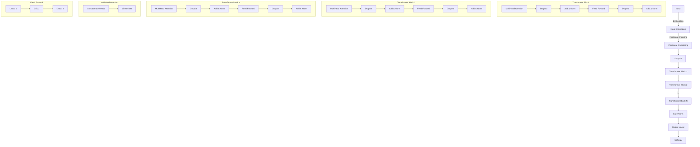

```mermaid
flowchart TD;
    A[Input] -->|Embedding| B[Input Embedding];
    B -->|Positional Encoding| C[Positional Embedding];
    C --> D[Dropout];
    D --> E[Transformer Block 1];
    E --> F[Transformer Block 2];
    F -->|...| G[Transformer Block N];
    G --> H[LayerNorm];
    H --> I[Output Linear];
    I --> J[Softmax];
    
    subgraph Transformer Block 1;
        E1[MultiHead Attention] --> E2[Dropout];
        E2 --> E3[Add & Norm];
        E3 --> E4[Feed Forward];
        E4 --> E5[Dropout];
        E5 --> E6[Add & Norm];
    end;
    
    subgraph Transformer Block 2;
        F1[MultiHead Attention] --> F2[Dropout];
        F2 --> F3[Add & Norm];
        F3 --> F4[Feed Forward];
        F4 --> F5[Dropout];
        F5 --> F6[Add & Norm];
    end;
    
    subgraph Transformer Block N;
        G1[MultiHead Attention] --> G2[Dropout];
        G2 --> G3[Add & Norm];
        G3 --> G4[Feed Forward];
        G4 --> G5[Dropout];
        G5 --> G6[Add & Norm];
    end;

    subgraph MultiHead Attention;
        MA[Concatenate Heads] --> MAW[Linear WO];
    end;

    subgraph Feed Forward;
        FF1[Linear 1] --> FF2[GELU];
        FF2 --> FF3[Linear 2];
    end;
```
