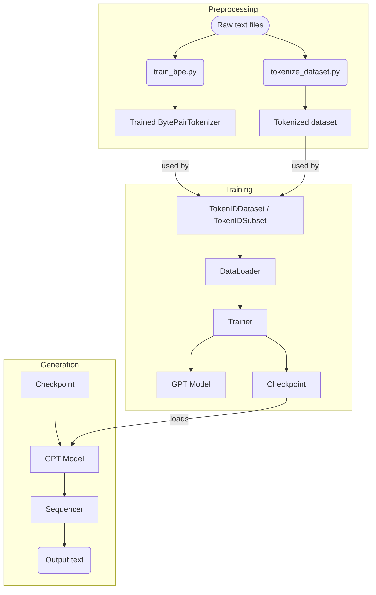

# Program Flow Overview

This document outlines the high-level workflow of the project and shows how the main modules interact. The diagram summarizes the preprocessing, training and generation stages.

## Stage descriptions

- **Preprocessing**
  - `train_bpe.py` trains a `BytePairTokenizer` from raw text files.
  - `tokenize_dataset.py` uses the trained tokenizer to convert the corpus into sequences of token IDs.

- **Training**
  - `TokenIDDataset`/`TokenIDSubset` create iterable datasets from the tokenized files.
  - `DataLoader` feeds batches to the `Trainer`.
  - `Trainer` runs the training loop on the `GPT` model, saving checkpoints for later use.

- **Generation**
  - The saved checkpoint is loaded into the `GPT` model.
  - The `Sequencer` performs autoregressive decoding to produce the final text output.
